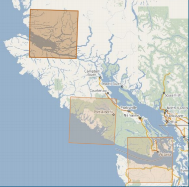
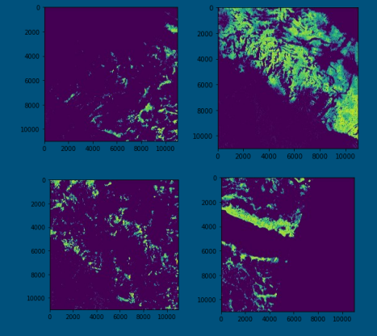
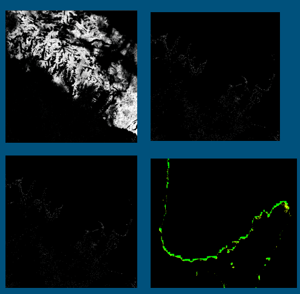

Project to Identify Seaweed Distribution in the BC Coast Using Sentinel-2 Satellite

# Platforms 
- Arbutus
* Google colab

# Tasks
- Analyze NDVI data
- Filter NDVI value > 0.4
- Mask Land Area
- Colored Image

## Test sites

# Colab
Visualized result of NDVI tiff data in Colab (Automatically rendering)

# Snap on arbutus
- Analyze NDVI data
- Filter NDVI value > 0.4
- Mask Land Area
- Colored Image

# Future Work
- Earth Data Storage in Arbutus
- Parallel computations on Azure Batch
- Combine the NDVI map with real map for Visualization