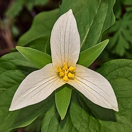

The pacific trillium is a high priority plant on the Committee on the Status of Endangered Wildlife Canada
The flower grows on Vancouver Island and some southern BC forested areas. The flower takes 4-7 years to flower from seed. We hope our project can help identify possible pacific trillium locations so they can be properly protected.

# Project goal

The goal of this project is to locate potential safe growth areas for pacific trillium in different parts of British Columbia.

# Platforms and Methods
Our completed project is hoping to use the following platforms:
- Arbutus Servers
- Google Colab

## Habitat we’re looking for

Based on the pacific trillium’s characteristics, we are looking for locations with the
following properties:

- Non barren locations with vegetation
- Locations that are higher in coniferous trees then deciduous trees
- Locations that do not suffer from cold temperatures

Sentinel 2 provides functionality for identifying locations with these properties.

## Locations under analysis

- South Vancouver Island, Shawnigan Lake Region
- Pacific Rim, Tofino Region
- South Coast British Columbia, Chilliwack Lake Region

## Indexes
- NDVI

How can we use sentinel 2 to find locations with this property?
- NDVI can be used to locate areas with
large amounts of vegetation
* NDVI ranges from [-1, 1] where
= values close to -1 represents bodies of water,
= values near 0 represent barren areas of rock, sand, or snow
= Values approaching 1 are forestry areas
* Therefore NDVI can be used to identify
potentially coniferous forest areas

- LAI
Coniferous trees can be distinguished
from deciduous trees by calculating LAI
- LAI calculates the size of a plants
leaves.
- This can be used to identify coniferous
trees as their leaves are needles that
stay the same year round.
- Coniferous trees differ from deciduous
trees as deciduous trees have leaves
that change year round.

- NDSI
- We can identify particularly cold areas through NDSI.
- NDSI allows us to identify areas that have had snow, which indicates cold temperature.
- Therefore, areas that have had a certain amount of snow should not have pacific trillium.

# Future Work
Data - add cloud mask,
Add Google colab as platform for visualization
Get code running on arbutus servers

