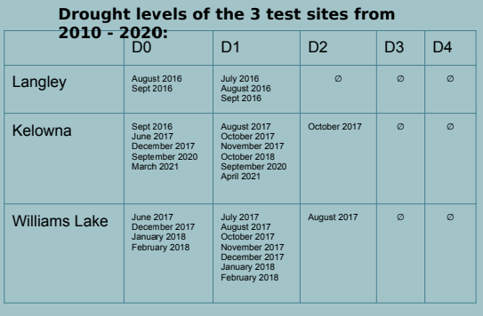

# Project goal

In this project, we want to access the relationship between Drought Indicator and a
series of condition indexes within British Columbia from 2016 to 2020. We hope to
find any evidence by accessing the weights using Neural Network. 

# Platforms 
We decided to use Google’s cloud services to accomplish our goals
- Google Data Storage Services
* Reliable and secure
* Store all index raw data
* Can be easily accessed through web app
- Compute Engine
* Provide virtual machine, data access are go through it
* Holds Neural Network Module, Raw Data can be directly pipelined into for training
- TPU
* A dedicated hardware accelerating training process.

## Three potential test sites:
We have decided to go for a diverse coverage of British Columbia’s regions to provide a mix of data points.
- Vancouver Coast - An important region with a mild
and rainy climate.
- Thompson Okanagan - An interior area with hot
summers and arid/dry atmosphere.
- Cariboo Chilcotin - Similar in aridity to the north
okanagan, but with shorter summers and harsher
winters.

## The condition indexes

- Drought Indicator
* Drought index = x * VCI + y *TCI + z * SMCI + offset
- Vegetation Condition Index
* VCI = (NDVI - min ) / (MAX -MIN) * 100
* NDVI collected from sentinel 2
-
Soil Moisture Condition Index
* SMCI = (SMI - min ) / (MAX -MIN) * 100
* Soil Moisture Index collected from Government of Canada
- Temperature Condition Index
* TCI = (LST - min ) / (MAX -MIN) * 100
* Land Temperature Index collected from LPDAAC

### Canadian Drought Monitor
0. (Abnormally Dry) - 3 to 5 years.
1. (Moderate Drought) - 5 to 10
years.
2. (Severe Drought) - 10 to 20
years.
3. (Extreme Drought) - 20 to 25
years.
4. (Exceptional Drought) - 50 years.

