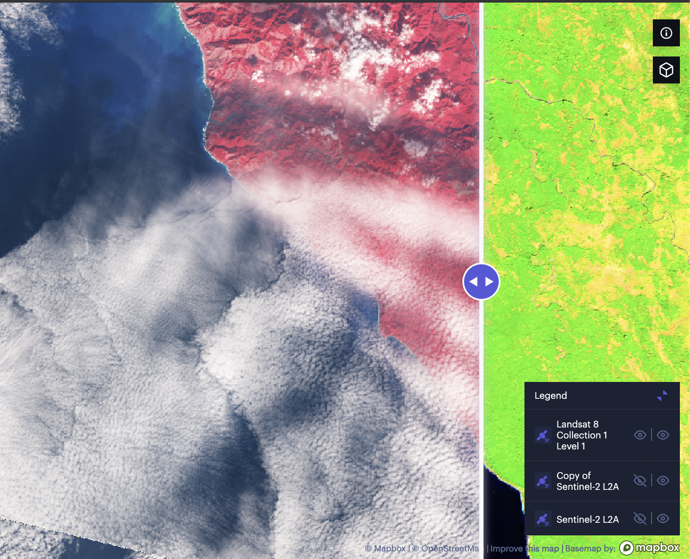

[View On Unfolded Studio](https://studio.unfolded.ai/public/dd8f0bad-ead6-4711-b7a4-a8b244fb0c5f/ "UnfoldedStudio").

## What does the earth heat level look like against earth imagery?
   - This tool allows an easy view of the earth's heat level against land.

EO has potential in monitoring and evaluating Nature-based Solutions for Net-Zero emissions worldwide. Combining satellite data with ground truth will allow us to gather metrics required to attract investment.

